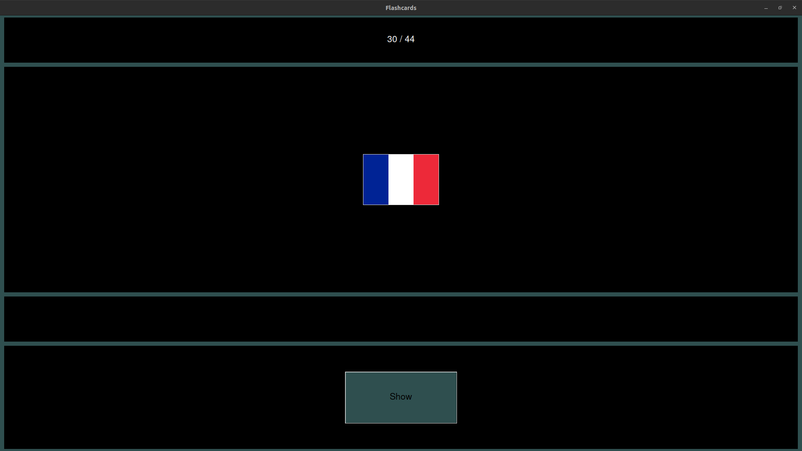
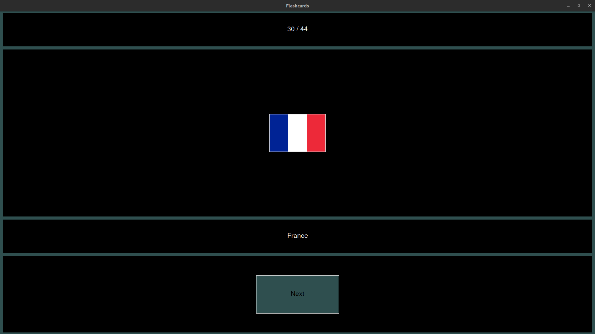

# Image Flashcards Engine

Simple graphical memory flashcards engine, quickly building flashcards only from a directory of named images.

<p align="center">
  
  
</p>

The flashcards have image on one side and text (the image name) on the other. 

The goal of this tool is to automate (with randomness) the learning of an image caption, mainly to recognize items, examples :
- recognize countries associated to flags
- recognize animals (species, breeds)
- recognize car models
- recognize monuments  
etc. 

The supplied example directory allows to make flashcards with the country flag on one side and the country name (in French) on the other one.

## Installation
### Quick install
```
$ pip install -r requirements.txt
```

### Inside a Python virtual environment
```
$ python3 -m venv venv
$ source venv/bin/activate
$ pip install -r requirements.txt
```

To deactivate the virtual environment :
```
$ deactivate
```

## Usage
### Quickstart

- Take the image-caption pairs you want to learn / review
- Name each image with its caption (ex: France.png), many image formats are supported.
- Put all the images into a main directory (you can use subdirectories in it, like in the `flag_images` example folder)
- Use the main directory name as script argument :
```
$ python3 image_flashcards_engine.py <YOUR_IMAGE_DIRECTORY>
```

Example :
```
$ python3 image_flashcards_engine.py flag_images
```

### Help command
To have full information on the usage : 
```
python3 image_flashcards_engine.py -h
```


